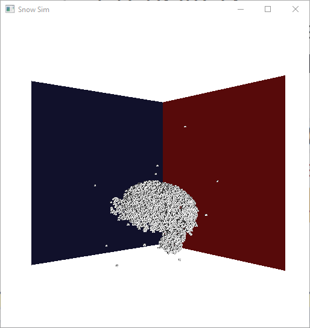

Final Report by Kevin Pick

Implementation of "A material point method for snow simulation" from
UCLA and Walt Disney Animation Studios

**Overview**

The goal of the implementation was to recreate the Disney snow paper on
the GPU as it was originally implemented on the CPU. The program is run
on an RTX 2080 with 8GB of VRAM utilizing CUDA to parallelize the
program. Since each stage presented in the algorithm section requires
independent computations or dependencies that can be resolved with
atomic addition, the conversion of the algorithm to utilize the GPU is
trivial. The only problematic computations are the polar decomposition
and SVD. For both kernels, preexisting CUDA implementations were used.

**Basic Concept**

As stated in class, the deformation of a body can be described as a
mapping from the undeformed configuration ***X*** to a deformed
configuration ***x*** as follows:
$x\  = \ \varphi(X)\  = \ F\ X\  + \ c$. Hence, $F$ must be a 3 x 3
matrix deformation gradient,
$F\  = \ \frac{\partial\varphi}{\partial X}$, by the aforementioned
equation. Since the deformation must obey the laws of physics, mass and
momentum are conserved and the body must change according to an
elasto-plastic constitutive relation:
$\frac{D\rho}{\text{dt}} = 0,\ \rho\frac{\text{Dv}}{\text{dt}} = \nabla\  \cdot \ \sigma\  + \ \rho g,\ \sigma = \ \frac{1}{J}\frac{\partial\Psi}{\partial F_{E}}F_{E}^{T}$.
Please note, $\rho$ is density, $t$ is time, $v$ is velocity, $\sigma$
is the Cauchy stress, $g$ is gravity, $\Psi$ is the energy density of
the elasto-plastic potential, $F_{E}$ is the elastic portion of the
deformation gradient $F$, and $J = det(F)$.

$$N\left( x \right) = \left\{ \begin{matrix}
\frac{1}{2}{|x|}^{3} - {|x|}^{2} + \frac{2}{3},\ \ \& 0 \leq |x| < 1 \\
\frac{- 1}{6}{|x|}^{3} + {|x|}^{2} - 2|x| + \frac{4}{3},\ \ \& 1 \leq |x| < 2 \\
0,\ \ \& otherwise \\
\end{matrix} \right.\ $$

The snow is represented via particles which require the position
$x_{p}$, velocity $v_{p}$, mass $m_{p}$, and deformation gradient
$F_{p}$ to be stored. To compute
$\rho\frac{\text{Dv}}{\text{dt}} = \nabla \cdot \sigma$, each particle
is transferred to a regular grid via the 1D B-spline curve function
$N(x)$.

$$N\left( d \right) = \left\{ \begin{matrix}
\frac{1}{2}d^{3} - d^{2} + \frac{2}{3},\ \ \& 0 \leq d < 1 \\
\frac{- 1}{6}d^{3} + d^{2} - 2d + \frac{4}{3},\ \ \& 1 \leq d < 2 \\
0,\ \ \& otherwise \\
\end{matrix} \right.\ \text{\ \ \ \ \ }N_{d}\left( d \right) = \left\{ \begin{matrix}
\frac{3}{2}d^{2} - 2d,\ \ \& 0 \leq d < 1 \\
\frac{- 1}{2}d^{2} + 2d - 2,\ \ \& 1 \leq d < 2 \\
0,\ \ \& otherwise \\
\end{matrix} \right.\ $$

The function computes the weight contribution of each particle's field
to a node's field on the regular grid. For a particle at position
$x_{p} = \{ x_{x},x_{y},x_{z}\}$ and a node located at
$n_{p} = \{ n_{x},n_{y},n_{z}\}\ $ on a grid with uniform spacing $h$,
${w_{n_{p}} = N}_{n}^{h}\left( x_{p} \right) = N\left( \frac{1}{h}\left( x_{x} - nh \right) \right)N\left( \frac{1}{h}\left( x_{y} - nh \right) \right)N\left( \frac{1}{h}\left( x_{z} - nh \right) \right)$.
These weights are used to transfer momentum and mass from the particle
to the grid. Hence, only particles within a distance of 2h of the node
will contribute to its fields.

$$N_{n_{w}}^{h}\left( x_{p} \right) = \left\{ \begin{matrix}
N_{x}\left( \frac{1}{h}\left( x_{x} - n_{x}h \right) \right)N\left( \frac{1}{h}\left( x_{y} - n_{y}h \right) \right)N\left( \frac{1}{h}\left( x_{z} - n_{z}h \right) \right) \\
N\left( \frac{1}{h}\left( x_{x} - n_{x}h \right) \right)N_{y}\left( \frac{1}{h}\left( x_{y} - n_{y}h \right) \right)N\left( \frac{1}{h}\left( x_{z} - n_{z}h \right) \right) \\
N\left( \frac{1}{h}\left( x_{x} - n_{x}h \right) \right)N\left( \frac{1}{h}\left( x_{y} - n_{y}h \right) \right)N_{z}\left( \frac{1}{h}\left( x_{z} - n_{z}h \right) \right) \\
\end{matrix} \right.\ $$

Lastly, the gradient of $N(x)$ is required to update force. By defining
distance variable $d = |x|$, we can transform $N(x)$ into $N(d)$ and
then define the gradient as
$N_{x}\left( x \right) = sign\left( x \right)*\ N_{d}(d)$ to avoid
differentiating an absolute value function. Thus,
${{\nabla w}_{n_{p}} = \nabla N}_{n}^{h}\left( x_{p} \right) = \{ N_{n_{x}}^{h}\left( x_{p} \right),\ N_{n_{y}}^{h}\left( x_{p} \right),\ N_{n_{z}}^{h}\left( x_{p} \right)\}$.

**Algorithm**

Assume we are on time step $t^{\alpha}$ and have the associated
position, velocity, mass, and deformation gradient of each particle
$p \in P$. Now, we attempt to advance the simulation by timestep
$\mathrm{\Delta}t$ to obtain $t^{\alpha + 1}$.

1.  Transfer particle fields to the grid using the weighting function:

$$m_{n}^{\alpha} = \sum_{p \in P}^{}{m_{p}w_{n_{p}}^{\alpha}}$$

Transfer velocity while maintaining conservation of momentum by
normalizing the resultant value by $m_{n}^{\alpha}$:

$$v_{n}^{\alpha} = \frac{1}{m_{n}^{\alpha}}\sum_{p \in P}^{}{m_{p}w_{n_{p}}^{\alpha}v}_{p}^{\alpha}$$

2.  Calculate particle volume and density since force discretization
    requires volume in the initial configuration. We consider the
    density of a cell in the grid to be the cell's mass over $h^{3}$.

$$\rho_{p}^{0} = \frac{1}{h^{3}}\sum_{n}^{}{w_{n}^{0}m}_{n}^{0}$$

> We approximate the volume of a particle as follows:

$$V_{p}^{0} = \frac{m_{n}}{\rho_{p}^{0}}$$

3.  To compute the forces within the grid:

    a.  The deformation gradient $F = F_{E}F_{P}$ is a combination of
        the elastic $F_{E}$ and plastic $F_{P}$ values. In the base
        state, the elastic and plastic portions of the gradient are set
        to the identity matrix as the system is undeformed.

    b.  Linear elasticity requires two Lamé parameters $\lambda$ and $µ$
        to be set. We utilize the suggested parameters from the paper
        for the initial Young's modulus, $E_{0}$, and the Possion's
        ratio, $v$:

        $\lambda_{0} = \frac{E_{0}v}{\left( 1 + v \right)(1 - 2v)}$ and
        $µ_{0} = \frac{E_{0}}{2\left( 1 + v \right)}$

    c.  The constitutive model uses the elasto-plastic energy density
        function with the Lamé parameters defined as functions of the
        plastic deformation gradient.

$$\Psi\left( F_{E}{,F}_{P} \right) = µ\left( F_{P} \right)|\left| F_{E} - F_{P} \right||_{F}^{2} + \frac{\lambda\left( F_{P} \right)}{2}(J_{E} - 1)^{2}$$

$µ\left( F_{P} \right) = µ_{0}e^{\xi(1 - J_{P})}$ and
$\lambda\left( F_{P} \right) = \lambda_{0}e^{\xi(1 - J_{P})}$

$J_{E} = \det\left( F_{E} \right)$ and
$J_{P} = \det\left( F_{P} \right)$

$R_{E}$ is the orthonormal component of the polar decomposition of
$F_{E} = R_{E}S_{E}$

$\xi$ is the parameter for constant of plastic hardening

d.  Node $n$ has the following force acting on it where the volume of
    the material of particle $p$ at time $\alpha$ with Cauchy stress
    $\sigma_{p}$ is $V_{p}^{\alpha} = J_{p}^{\alpha}V_{p}^{0}$:

$$\text{forc}e_{n}\left( x \right) = - \sum_{p \in P}^{}{V_{p}^{\alpha}\sigma_{p}\nabla w_{n_{p}}^{\alpha}}$$

$$\sigma_{p} = \frac{1}{J_{p}^{\alpha}}\frac{\partial}{\partial F_{E}}\Psi(F_{E_{p}}^{\alpha},F_{P_{p}}^{\alpha})(F_{E_{p}}^{\alpha})^{T} = \frac{2µ\left( F_{P_{p}}^{\alpha} \right)}{J_{p}^{\alpha}}(F_{E_{p}}^{\alpha} - R_{P_{p}}^{\alpha})(F_{E_{p}}^{\alpha})^{T} + \frac{\lambda\left( F_{P_{p}}^{\alpha} \right)}{J_{p}^{\alpha}}(J_{E_{p}}^{\alpha} - 1)J_{E_{p}}^{\alpha}I$$

4.  Grid velocities can be update according to standard formulas:

$$v_{n}^{*} = v_{n}^{\alpha} + \nabla t\frac{\text{forc}e_{n}^{\alpha}}{m_{n}^{\alpha}}$$

5.  Collisions between grid cells and objects must be taken into account
    such that when a collision occurs,
    $\varphi\left( x_{n} \right) \leq 0$, the normal,
    $n = \nabla\varphi\left( x_{n} \right)$, and the colliding object's
    velocity, $v_{\text{col}}$, are computed:

    Transfer the grid velocity to relative velocity in the collision
    frame of the colliding object:

$$v_{\text{rel}} = v_{n}^{*} - v_{\text{col}}$$

Normal component magnitude of the relative velocity:

$$v_{n} = {\alpha*v}_{\text{rel}}$$

If ${0 \leq v}_{n}$, meaning bodies are separating, no collision is
applied; otherwise, the velocity in the tangent direction is computed:

$$v_{t} = v_{\text{rel}} - \ \alpha*v_{\alpha}$$

If the following is true ($µ$ is the friction coefficient):

$|\left| v_{t} \right|| \leq - µv_{\alpha}$, then
${v^{'}}_{\text{rel}} = v_{t} + \frac{\text{µv}_{\alpha}}{||v_{t}||}v_{t} = (1 + \frac{\text{µv}_{\alpha}}{\left| \left| v_{t} \right| \right|})v_{t}$

Otherwise:

$${v^{'}}_{\text{rel}} = 0$$

Lastly, the velocity must be moved back into the world frame:

$${v^{*'}}_{n} = {v^{'}}_{\text{rel}} + v_{\text{col}}$$

6.  Integration is currently performed explicitly
    $v_{n}^{\alpha + 1} = v_{n}^{*}$.

7.  The deformation gradient needs to be updated according to the
    following procedure:

    e.  Update the deformation gradient.

$$F_{p}^{\alpha + 1} = (\nabla tv_{p}^{\alpha + 1} + I)F_{E_{p}}^{\alpha}F_{P_{p}}^{\alpha}$$

${\widehat{F}}_{E_{p}}^{\alpha + 1} = (\nabla tv_{p}^{\alpha + 1} + I)F_{E_{p}}^{\alpha}$
and ${\widehat{F}}_{P_{p}}^{\alpha + 1} = F_{P_{p}}^{\alpha}$ for
temporary changes to elastic portion of the deformation gradient

f.  To add controls to the simulation, we define a critical deformation
    threshold which is applied as follows:

    ${\widehat{F}}_{E_{p}}^{\alpha + 1} = U_{p}{\widehat{\Sigma}}_{p}{V^{T}}_{p}$
    (SVD computation)

$$\Sigma_{p} = clamp({\widehat{\Sigma}}_{p},\ \left\lbrack 1 - \Theta_{c},\ 1 + \Theta_{s} \right\rbrack)$$

$\Theta_{c}$ is the critical compression ratio and $\Theta_{s}$ is the
critical stretch ratio of the material

g.  Using the clamped SVD computation of the elastic component of the
    deformation gradient, we can compute the plastic component of the
    deformation gradient by recombining the values.

    $F_{E_{p}}^{\alpha + 1} = U_{p}\Sigma_{p}{V^{T}}_{p}$,
    $F_{P_{p}}^{\alpha + 1} = V_{p}{\Sigma_{p}}^{- 1}U_{p}^{T}F_{p}^{\alpha + 1}$

h.  The particle velocities must be updated according to the rules of a
    PIC (particle-in-cell) / FLIP (fluid-implicit-particle) simulation:

    $v_{p}^{\alpha + 1} = lerp(v_{\text{PI}C_{p}}^{\alpha + 1},v_{\text{FLI}P_{p}}^{\alpha + 1},\beta)$
    where $\beta$ is some constant

$$v_{\text{PI}C_{p}}^{\alpha + 1} = \sum_{n}^{}v_{n}^{\alpha + 1}w_{n_{p}}^{\alpha}$$

$$v_{\text{FLI}P_{p}}^{\alpha + 1} = v_{p}^{\alpha} + \sum_{n}^{}{(v_{n}^{\alpha + 1}} - v_{n}^{\alpha})w_{n_{p}}^{\alpha}$$

8.  Particle body collision uses the same formulas as grid body
    collision where:

$$v_{\text{rel}} = v_{p}^{\alpha + 1} - v_{\text{col}}$$

9.  Lastly, we update the particle's position via a standard formula:

$$x_{p}^{\alpha + 1} = x_{p}^{\alpha} + \nabla tv_{p}^{\alpha + 1}$$

**Results**

The overall program executes at approximately 19-20 FPS with 10k
particles and a grid size of 100x100x100. A wavefront object loader was
also created to load in mesh to be sampled for particles. To obtain the
starting position and mass of each particle, the mesh is voxelized and
uniformly sampled via rejection sampling methods. The volume is
calculated and the particle's mass is set to
$m_{p} = target\_ density*\frac{\text{volume}}{num\_ particles}$.
Results of the simulation are shown in Diagrams 1 and 2 with snow
particles represented as cubes.

**Diagram 1**

{width="1.5in"
height="1.5875481189851268in"}{width="1.5in"
height="1.5875481189851268in"}{width="1.5in"
height="1.5875481189851268in"}{width="1.5in"
height="1.5875481189851268in"}{width="1.5in"
height="1.5875481189851268in"}{width="1.5in"
height="1.5875481189851268in"}{width="1.5in"
height="1.5875481189851268in"}{width="1.5in"
height="1.5875481189851268in"}

100k snow particles from a monkey head mesh are dropped on a moving
ball. Screenshots are taking every five-frame interval.

**Diagram 2**

{width="1.0in"
height="1.0583661417322834in"}{width="1.0in"
height="1.0583661417322834in"}{width="1.0in"
height="1.0583661417322834in"}{width="1.0in"
height="1.0583661417322834in"}{width="1.0in"
height="1.0583661417322834in"}{width="1.0in"
height="1.0583661417322834in"}{width="1.0in"
height="1.0583661417322834in"}{width="1.0in"
height="1.0583661417322834in"}{width="1.0in"
height="1.0583661417322834in"}{width="1.0in"
height="1.0583661417322834in"}{width="1.0in"
height="1.0583661417322834in"}{width="1.0in"
height="1.0583661417322834in"}{width="1.0in"
height="1.0583661417322834in"}{width="1.0in"
height="1.0583661417322834in"}{width="1.0in"
height="1.0583661417322834in"}{width="1.0in"
height="1.0583661417322834in"}{width="1.0in"
height="1.0583661417322834in"}{width="1.0in"
height="1.0583661417322834in"}

100k snow particles from a torus mesh hitting the top wall and sliding
(the wall is not rendered). Screenshots are taken every five-frame
interval.
